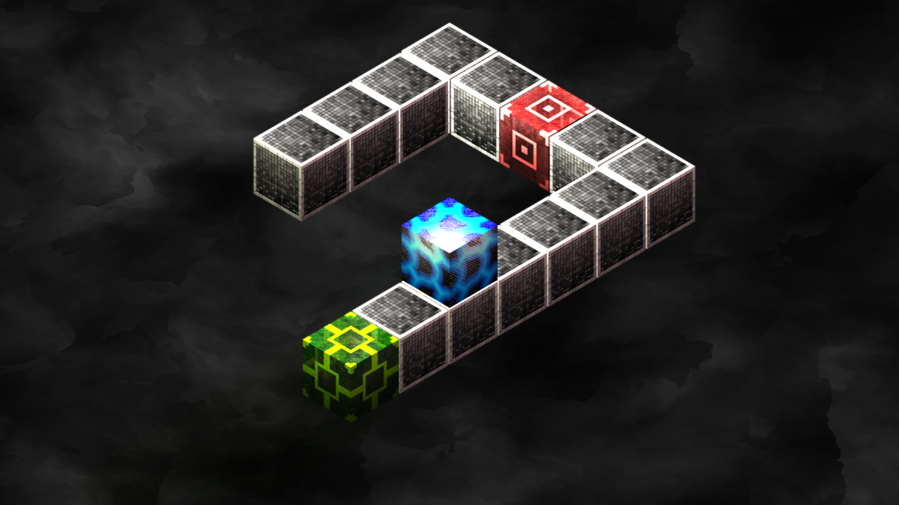
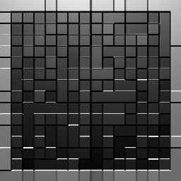
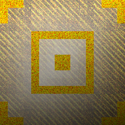
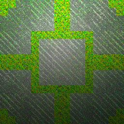

# WYSIWYG-2
A cross-platform 3D game featuring a cube in a world riddled with optical illusions.

## Installation
1. Go to the [releases](https://github.com/QuarksAndLeptons/WYSIWYG-2/releases/) tab and download the latesest release that matches your operating system and CPU architecture
2. Extract the files
3. Run the executable file labeled "wysiwyg2"

## How to Play
The goal of the game is simple: move the player to a green goal block to advance to the next level. To move the player, click (or tap with a touch screen) in the general direction you want to move the player, i.e. if you want to go to a block that appears to be on the top and left of the player, click on the top left side of the screen.
The player block can rest on top of any other existing block in the game, but different blocks interact with the world and the player block in different ways. Here is a list of all existing blocks and what they do:

Block | Description
----- | -----------------
 | A simple block that does nothing special
 | This is you!
 | A block that rotates the view clockwise. It really puts a new perspective on the game!
 | Like the previous block, but rotates the view in the *opposite* direction
 | The goal block. Land on top of it to advance to the next level
 | Play to find out what this block does!

If you're stuck, press a mouse button for three seconds and a menu will appear. In the backgound, you can rotate the view with the mouse for a better look at the rest of the field. 

## For Developers 
To edit and run the source code, you will need the [Processing IDE](processing.org). To make it a valid Processing sketch, rename the program folder to "wysiwyg2" to match the name of the main program file. No additional libraries or fonts are required, as OS-independent Processing methods are used for all graphics and rendering.

The original Python version can be found [here](https://github.com/QuarksAndLeptons/WYSIWIG-Game), though the original game and level editor are contained in this repository under the data directory. To run these scripts, you will need [Python 3](python.org) and the [Pygame](pygame.org) library. The old game needs some work, but the level editor should run on every device. The controls are completely key-based. Here are the standard keys:
 * A/D - Move controller block left or right. 
 * W/S - Move controller block forward or backward
 * Q/E - Move controller block up or down
 * J/K - rotate the view left or right
 * N/M - rotate the view up or down
 * spacebar/backspace - Create/destroy blocks where the controller is at
 * U/I - Go to the next/previous level. THIS DOES NOT SAVE YOUR LEVEL DESIGN!
 * R   - Reset the view and the controller's position
 * 1-5 - Change the created block type to regular, rotateC, rotateCC, goal, or mysterious, respectively.
 * P   - Save the level. PRESS THIS OFTEN!
 * C   - Clear the contents of this level and resets the view and the controller's position. Doesn't overwrite the level, so you can still revert to the last save.
 * escape - exit the level editor

## So how does it work?
This is a [Processing sketch](https://processing.org/), using the Java mode. I created the assets by hand with the [GIMP](https://www.gimp.org/).

This game was developed _on_ a Raspberry Pi _for_ a Raspberry Pi, but it can be run on every operating system that can run Java.

### Overview
The components of this game are split into seven files. Note that in Processing, files are used for orgainizing code, and at compile-time they are all combined under one Wysiwyg2 class.
1. [config](wysiwyg2/config.pde) contains settings with default values. They can be changed at runtime in the menu.
2. [engine](wysiwyg2/engine.pde) describes how to render everything *besides* the UI.
3. [game](wysiwyg2/game.pde) contains high-level game behavior, like how levels are organized.
4. [globals](wysiwyg2/globals.pde) contains global variables for the game, like sprite and game data. It also contains a method that loads this data from files in the repository.
5. [mechanics](wysiwyg2/mechanics.pde) is the file holding more nitty-gritty details about the game mechanics, like camera behavior and how levels are loaded.
6. [ui](wysiwyg2/ui.pde) has everything related to the menu system. 
7. [wysiwig2](wysiwyg2/wysiwig2.pde) contains all the methods that are built into Processing and used in this sketch: `setup`, `draw()`,
`mousePressed`, and `mouseReleased`.

### Rendering Pipeleine
The rendering pipeline has four phases outlined below. The entire pipeline is under the *engine* file.
1. The **animated background** is a shader written in GLSL and rendered on a PGraphics object in 2D mode called `background`.
2. Above that is the **game renderer**. This is where all the blocks and lights are rendered. It's a PGraphics object in 3D mode called `render`.
3. Above that is the **post processing pipeline** responsible for motion blur (if enabled). It's a PGraphics object in 2D mode called `postProcessing`.
4. The top layer is the **menu graphics**. All menu buttons are rendered here. It's a PGraphics object in 2D mode called `menuGraphics`.

## Questions?
Please post issues under the *[issues](https://github.com/QuarksAndLeptons/WYSIWYG-2/issues)* tab. For cool level ideas, fork this repository and request a merge at [Github](https://github.com/m516/WYSIWYG-2), and you might see your own level in the next release!

